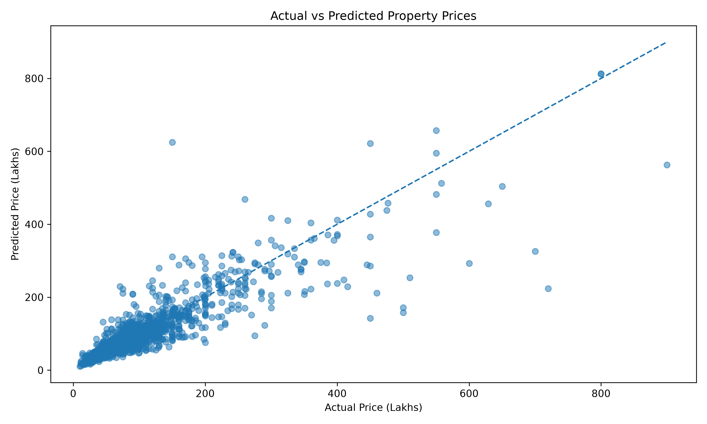
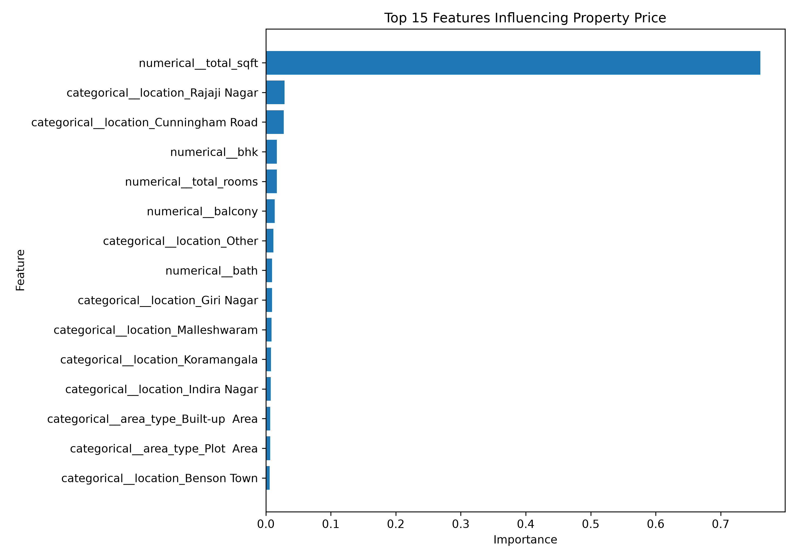

# 🏠 Real Estate Price Predictor & Investment Analyzer

### BCS586 Data Science Mini Project

A Machine Learning-based web application that predicts residential property prices and analyzes potential investment opportunities using property features and geographical information.

---

## 📊 Key Results

| Metric | Improved Random Forest |
|---|---:|
| R² Score | **0.7758** |
| MAE | **₹19.18 Lakhs** |
| RMSE | **₹39.34 Lakhs** |
| Final Dataset | **9,863 properties** |

---

## 📌 Project Overview

The **Real Estate Price Predictor & Investment Analyzer** uses regression-based Machine Learning techniques to estimate residential property prices.

The system takes property information such as:

- 📍 Location
- 📐 Total area
- 🛏️ Number of bedrooms
- 🚿 Number of bathrooms
- 🌇 Number of balconies
- 🏢 Area type

and predicts the estimated property price.

The application also compares the predicted price with the property's listing price to provide an investment screening signal indicating whether the property may be potentially **undervalued, fairly priced, or overvalued** relative to the model estimate.

---

## 🎯 Objectives

The main objectives of this project are:

1. Analyze real estate property data.
2. Clean and preprocess the dataset.
3. Perform exploratory data analysis.
4. Engineer useful features for Machine Learning.
5. Remove significant price-per-square-foot outliers.
6. Train regression models for property price prediction.
7. Compare different regression models.
8. Develop an improved Random Forest model.
9. Build an interactive Streamlit web application.
10. Provide an investment analysis based on predicted and listing prices.
11. Analyze property prices across different locations.

---

## 📊 Dataset

The project uses the **Bengaluru House Price Dataset**.

The original dataset contains information about residential properties in Bengaluru.

### Main Features

| Feature | Description |
|---|---|
| `area_type` | Type of property area |
| `availability` | Property availability |
| `location` | Property location |
| `size` | Property size/BHK information |
| `society` | Society/project name |
| `total_sqft` | Total property area |
| `bath` | Number of bathrooms |
| `balcony` | Number of balconies |
| `price` | Property price in lakhs |

After preprocessing and feature engineering, the model uses features including:

- Area type
- Location
- Total square feet
- Bathrooms
- Balconies
- BHK
- Total rooms

---

## 🔬 Project Methodology

```text
Raw Dataset
     ↓
Data Inspection
     ↓
Data Cleaning
     ↓
Exploratory Data Analysis
     ↓
Feature Engineering
     ↓
Price-per-Sq.Ft Outlier Removal
     ↓
Train/Test Split
     ↓
Model Training
     ↓
Model Evaluation
     ↓
Improved Random Forest
     ↓
Streamlit Web Application
     ↓
Investment Analysis
```

---

## 🧹 Data Preprocessing

The following preprocessing operations were performed:

- Handling missing values
- Removing duplicate records
- Converting property area into numerical values
- Extracting BHK information
- Creating `price_per_sqft`
- Creating `total_rooms`
- Removing price-per-square-foot outliers
- Filtering extreme property prices
- Preparing categorical and numerical features for Machine Learning

### Dataset Transformation

```text
Original dataset
        ↓
13,320 records
        ↓
Data cleaning
        ↓
Feature engineering
        ↓
Outlier removal
        ↓
Final modeling dataset
```

---

## 🧠 Machine Learning Models

Three model stages were evaluated during development.

### 1. Linear Regression

| Metric | Result |
|---|---:|
| MAE | 43.83 |
| RMSE | 113.99 |
| R² Score | 0.4393 |

### 2. Random Forest

| Metric | Result |
|---|---:|
| MAE | 33.83 |
| RMSE | 102.29 |
| R² Score | 0.5485 |

### 3. Improved Random Forest

| Metric | Result |
|---|---:|
| MAE | 19.18 |
| RMSE | 39.34 |
| R² Score | 0.7758 |

### Final Model

The **Improved Random Forest Regression model** was selected as the final model because it achieved the best performance among the evaluated models.

---

## 📈 Final Model Performance

```text
R² Score : 0.7758
MAE      : ₹19.18 Lakhs
RMSE     : ₹39.34 Lakhs
```

### Interpretation

- **R² Score** indicates how well the model explains variation in property prices.
- **MAE** represents the average absolute prediction error.
- **RMSE** gives greater weight to larger prediction errors.

The improved Random Forest achieved a substantially better performance than the initial Linear Regression and Random Forest models.

---

## 🖥️ Streamlit Application

The project includes an interactive web application developed using **Streamlit**.

### 🏠 Price Predictor

Users can enter:

- Location
- Area
- BHK
- Bathrooms
- Balconies
- Area type

The application then generates an estimated property price.

### 💰 Investment Analyzer

The Investment Analyzer compares:

```text
ML Estimated Price
        vs
Listing Price
```

It calculates:

- Price difference
- Percentage difference
- Listing price per square foot
- Predicted price per square foot

The application provides a screening signal:

```text
🟢 Potentially Undervalued
🟡 Relatively Fair Price
🔴 Potentially Overvalued
```

### 📊 Model Performance

The application displays:

- R² Score
- MAE
- RMSE
- Model comparison
- Actual vs Predicted visualization
- Feature importance

### 📍 Location Analysis

Users can select a location and view:

- Median property price
- Average property price
- Median price per square foot
- Area vs price scatter plot

---

## 📊 Visualizations

The project generates visualizations including:

### Actual vs Predicted Prices



### Feature Importance



---

## 🛠️ Technologies Used

### Programming Language

- Python

### Data Science & Machine Learning

- Pandas
- NumPy
- Scikit-learn

### Data Visualization

- Matplotlib
- Seaborn

### Web Application

- Streamlit

### Model Storage

- Joblib

### Development Tools

- VS Code
- Git
- GitHub

---

## 📁 Project Structure

```text
real-estate-price-predictor/
│
├── app.py
├── README.md
├── requirements.txt
├── .gitignore
│
├── actual_vs_predicted.png
├── feature_importance.png
│
├── data/
│   ├── Bengaluru_House_Data.csv
│   ├── cleaned_housing.csv
│   └── final_housing.csv
│
├── models/
│   └── real_estate_price_model.pkl
│
└── src/
    ├── clean_data.py
    ├── eda.py
    ├── feature_engineering.py
    ├── improve_model.py
    ├── inspect_data.py
    ├── model_analysis.py
    ├── random_forest_model.py
    └── train_model.py
```

---

## 🚀 Installation & Setup

### 1. Clone the repository

```bash
git clone https://github.com/Parthtiwari028/real-estate-price-predictor.git
```

### 2. Navigate to the project

```bash
cd real-estate-price-predictor
```

### 3. Create a virtual environment

```bash
python -m venv venv
```

### 4. Activate the virtual environment

#### Windows PowerShell

```powershell
.\venv\Scripts\Activate.ps1
```

### 5. Install dependencies

```bash
pip install -r requirements.txt
```

### 6. Run the Streamlit application

```bash
streamlit run app.py
```

The application will be available at:

```text
http://localhost:8501
```

---

## 🔎 Example Workflow

```text
User enters property details
             ↓
       ML Model Prediction
             ↓
    Estimated Property Price
             ↓
      Listing Price Input
             ↓
     Investment Comparison
             ↓
Potentially Undervalued / Fair / Overvalued
```

---

## ⚠️ Disclaimer

The property prices generated by this application are **Machine Learning-based estimates**.

The investment signals are intended only as a **screening indicator** and should not be considered guaranteed property valuations or financial advice.

Actual property prices may vary due to factors such as market conditions, property condition, exact location, amenities, legal status, and other factors not captured by the dataset.

---

## 🎓 Academic Information

**Course:** BCS586 - Data Science

**Project:** Real Estate Price Predictor & Investment Analyzer

**Domain:** Data Science / Machine Learning

**Model:** Improved Random Forest Regression

**Application:** Streamlit Web Application

---

## 👨‍💻 Author

**Parth Tiwari**

B.E./B.Tech - Computer Science & Engineering

---

## ⭐ Future Scope

Possible future improvements include:

- Integration with live real estate listings
- Advanced geographical analysis
- Interactive map-based visualization
- XGBoost model comparison
- More advanced hyperparameter tuning
- Real-time property data
- Deployment using Streamlit Cloud or another hosting platform
- More detailed investment-return analysis
